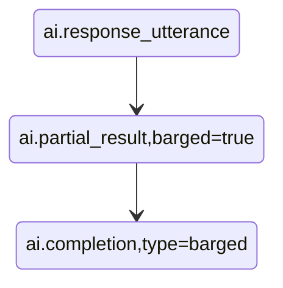
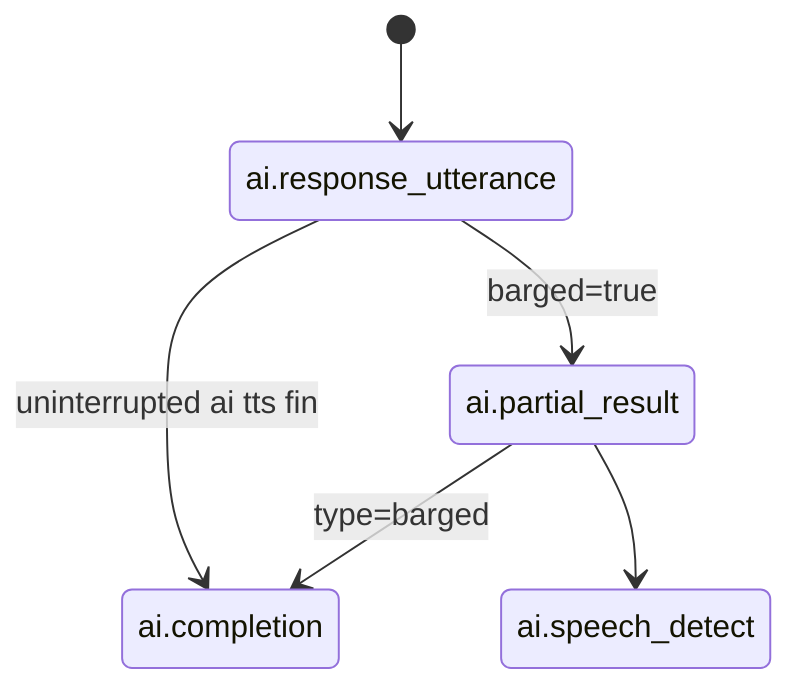

# Chat Management

As of yet, the AI-Human chat live transcription feed is sent with a series of events on the
main SignalWire (-> WSClient.on) event.

## When user is talking:

```mermaid
stateDiagram-v2
    "ai.partial_result" --> "ai.partial_result": "Ongoing transcription"
    "ai.partial_result" --> "ai.speech_detect": "Speech finalized"
```

note: Every partial result **replaces** last partial result unless a `speech_detect` event is sent.

## When AI is talking uninterrupted:

```mermaid
stateDiagram-v2
    "ai.response_utterance" --> "ai.response_utterance": "AI speaking"
    "ai.response_utterance" --> "ai.completion": "AI Is done talking (TTS Done)"
```

note: Every response utterance **adds up** to the final complete response.

## When user interrupts ('barge'):



## handling in code



## Deciding who spoke last

It looks necessary to keep track of partial text from both AI and user as conversation progresses. But
to decide who spoke last, we use the following heuristic:

```
if lastevent is ai.response_utterance, then AI spoke last
if lastevent is ai.completion type=normal, then AI spoke last
if lastevent is ai.completion type=barged, then user spoke last

if lastevent is ai.partial_result barged=true, then user spoke last and this is the new beginning of user speech
if lastevent is ai.speech_detect, then user spoke last
```

# Deciding when things go to history

```
if lastevent is ai.response_utterance, then add to partial result; last_spoken=ai
if lastevent is ai.completion type=normal, then push to history; reset ai partial result; last_spoken=ai
if lastevent is ai.completion type=barged, then push to history; reset ai partial result; last_spoken=user

if lastevent is ai.partial_result barged=true, then replace user partial result; last_spoken=user
if lastevent is ai.partial_result barged=false, then replace user partial result; last_spoken=user
if lastevent is ai.speech_detect, then add to history; reset user partial result; last_spoken=user
```


## Code description:

The `Call` class manages the `SignalWireClient` and the `Call` object. 
So for now, it is a reasonable place to hook into the `SignalWireClient` chat events.

The `Chat` class manages the chat state. The Chat UI is rendered by `chat.ui.ts`

To render chat UI, I'm simply transforming all chat history into DOM with a pure function.

## Updates may 9, 2025

new information:

1. `ai.begin_speaking` - when AI starts speaking
2. `ai.transparent_barge` - stop what AI was saying, delete the last AI message
3. `ai.speech_detect` can occur without preceding `ai.partial_result`