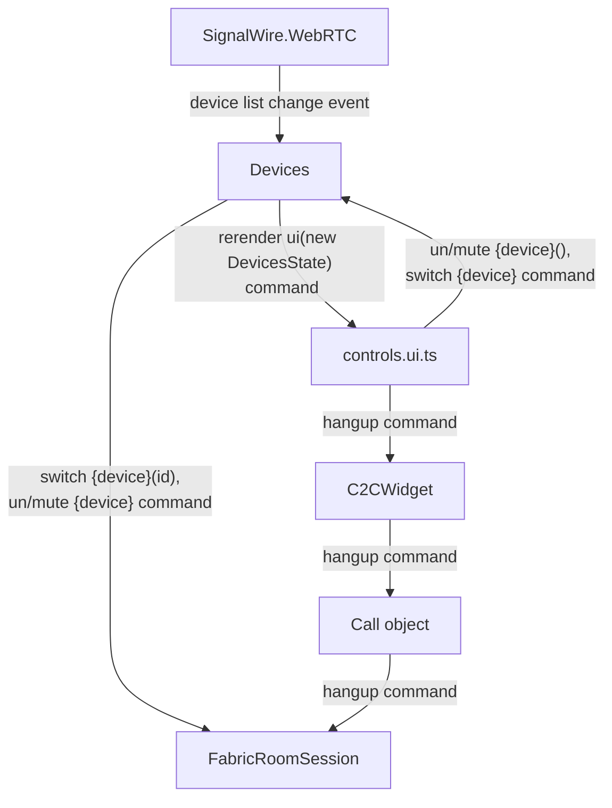

# Device management

The logic for device management is handled in the `Devices` class. This class
uses `@signalwire/webrtc` to enumerate devices and switch between them.

The UI for device management is handled in the `controls.ui.ts` file. It creates new
`DeviceMenu` objects when user clicks the device menu button.

## notes mar 26

The device management and control buttons rendering has to be redone.

The current implementation has logic and state spread between `Devices` class, `Call` class, 
`controls.ui.ts`, and `C2CWidget` class.  It is riddled with callbacks and a messy flow 
of commands, events and state.  In general, the code has become the bad kind of complex, 
and I can't be sure there aren't subtle bugs or that it'll handle all cases gratefully.

I underestimated the dependency between Device Management and the FabricRoomSession object. As of now, 
FabricRoomSession's handling of device management is incomplete so can't be fully relied upon. However,
it is also important that I first try the official SDK device management before falling back to native methods.

Every new feature I add contributes to the mess exponentially, and I don't think it's good
to keep on piling on to this mess. My next steps are as follows: 

1. `Devices` class becomes a singleton. Instead of `await`ing it's creation (to make sure we get permissions), it
    has callbacks that are called when the devices are ready. (do we even need to wait for permissions? does SDK does this anyway?)
2. `Devices` class holds a reference to the current call `FabricRoomSession` object to pull it's local audio and video tracks. 
    `Devices` class will be considered fully coupled with the `FabricRoomSession` object. Trying to keep them separate was a mistake.
3. `Devices` class has a `DevicesState` object which holds all the state for the devices. Rough shape:
    ```ts
    type DevicesState = {
        // list of all devices available to us
        audioinputDeviceList: MediaDeviceInfo[];
        videoinputDeviceList: MediaDeviceInfo[];
        audiooutputDeviceList: MediaDeviceInfo[];

        // what device are we currently using?
        currentAudioInputDevice: MediaDeviceInfo | null;
        currentVideoInputDevice: MediaDeviceInfo | null;
        currentAudioOutputDevice: MediaDeviceInfo | null;

        // this holds information about whether user *wants* the device muted
        // we should honor user's command in every case, whether the SDK has permissions or not.
        isAudioMuted: boolean;
        isVideoMuted: boolean;
        isSpeakerMuted: boolean;

        currentCall: FabricRoomSession | null;
    }
    ```
4. `Devices` class responsibilities are limited to:

    a. keeping the state up to date by hooking into the various events
    
    b. handling the logic of switching devices (using `FabricRoomSession`'s methods)

    c. handling the logic for muting/unmuting devices (using `FabricRoomSession`'s methods; then falling back to native methods)

    d. emitting events when a. devices are ready b. UI needs updating

5. `controls.ui.ts` only triggers when `Devices` emits the UI needs updating event. It builds up the UI using the `DevicesState` object.
6. `controls.ui.ts` passes commands from the user to the `Devices` class. If changes happen, `Devices` emits an event and `controls.ui.ts` updates the UI.
7. My current implementation for `DeviceMenu` is needlessly JS-heavy. I can use simple CSS for menus, using JS to simply toggle the menu open/close.

Rough flow:



## The 5 second timeout issue

There's a problem. If the user doesn't allow or deny permissions within 5 seconds, a timeout error is thrown by the SDK.
It seems to be hardcoded in the signalwire webrtc wrapper for getUserMedia. This is rather annoying for the user, so if it can be removed, it should.

```ts title="@signalwire/webrtc/src/utils/getUserMedia.ts"
export const getUserMedia = async (
  constraints: MediaStreamConstraints = { audio: true, video: true }
) => {
  try {
    const promise = getMediaDevicesApi().getUserMedia(constraints)
    const useTimeout = await _useTimeoutForGUM(constraints)
    if (useTimeout) {
      const exception = new Error('Timeout reading from your devices')
      return await timeoutPromise<MediaStream>(promise, GUM_TIMEOUT, exception)
    }
    //...
  }
}
```