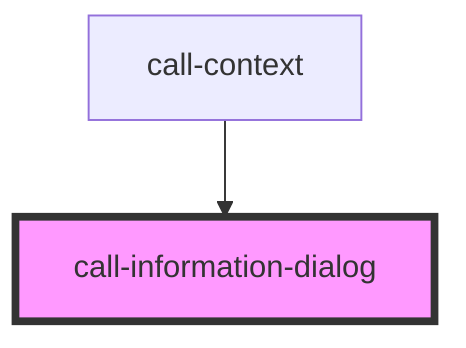

# call-information-dialog

<!-- Auto Generated Below -->

## Properties

| Property                    | Attribute       | Description | Type     | Default     |
| --------------------------- | --------------- | ----------- | -------- | ----------- |
| `message` _(required)_      | `message`       |             | `string` | `undefined` |
| `messageTitle` _(required)_ | `message-title` |             | `string` | `undefined` |

## Events

| Event          | Description | Type                |
| -------------- | ----------- | ------------------- |
| `dialogClosed` |             | `CustomEvent<void>` |

## Dependencies

### Used by

 - [call-context](../call-context)

### Graph

----------------------------------------------

*Built with [StencilJS](https://stenciljs.com/)*
